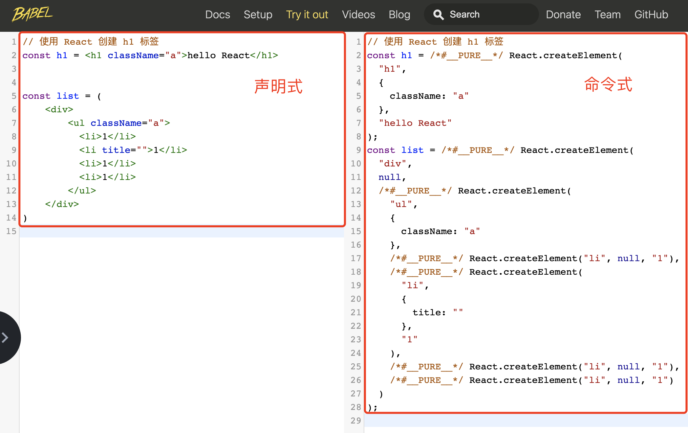
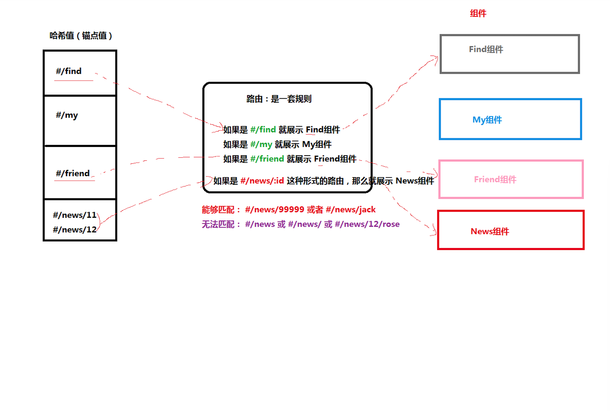

- create-react-app`是FaceBook的React团队官方出的一个构建React应用的脚手架工具
- 命令：`npx create-react-app react-basic`
  - react-basic 表示项目名称，可以修改
- 启动项目：`yarn start`or `npm start`

+ npx是 npm v5.2 版本新添加的命令，用来简化 npm 中工具包的使用
  - 原始：1 全局安装`npm i -g create-react-app` 2 在通过脚手架的命令来创建 React 项目
  - 现在：npx 调用最新的 create-react-app 直接创建 React 项目

**总结**

+ `create-react-app`是react官方提供一个脚手架工具，用于创建react项目
+ 通过`npx create-react-app react-basic`命令可以快速创建一个react项目

# react 的基本使用

1. 导入`react`和`react-dom`   
2. 创建react元素(虚拟DOM)
3. 渲染react元素到页面中

```jsx
// 导入react和react-dom
import React from 'react'
import ReactDOM from 'react-dom'

// 创建元素
// 参数1. 标签名
// 参数2. 标签属性——对象  { id: 'box' }
// 参数3. 标签内容，支持多个
const title = React.createElement('h1', { id: 'box' }, 'hello react')

// 渲染react元素
// 参数1. 需要渲染的 DOM
// 参数2. 渲染到哪个DOM节点上
ReactDOM.render(title, document.getElementById('root'))
```

# JSX

+ [ ] JSX 介绍
+ [ ] JSX 中使用 JavaScript 表达式
+ [ ] JSX 列表渲染
+ [ ] JSX 条件渲染
+ [ ] JSX 样式处理

## JSX介绍

`JSX`是`JavaScript XML`的简写，表示了在Javascript代码中写XML(HTML)格式的代码

优势：声明式语法更加直观，与HTML结构相同，降低学习成本，提高开发效率。

 **JSX是react的核心内容**

注意：*JSX 不是标准的 JS 语法，是 JS 的语法扩展。脚手架中内置的 [@babel/plugin-transform-react-jsx](@babel/plugin-transform-react-jsx) 包，用来解析该语法。*



**总结**

1. 使用jsx创建元素是react声明式UI的体现
2. 使用jsx语法更加直观，降低学习成本，提高开发效率

## JSX使用步骤

**目标**：掌握在react项目中如何使用jsx

**内容**

1. 导入reactDOM包
2. 使用jsx创建react元素
3. 将react元素渲染到页面中

**核心代码**

```js
import ReactDOM from 'react-dom'

// 创建元素
const title = <h1 title="哈哈"></h1>

// 渲染元素
ReactDOM.render(title, document.getElementById('root'))
```

**注意**：react17版本之后，使用jsx不需要额外导入React。

## JSX注意事项

**目标**： 了解在使用jsx时需要注意的事项

**内容**:

+ JSX必须要有一个根节点， 如果没有根节点，可以使用`<></>`或者`<React.Fragment></React.Fragment>`
+ 所有标签必须结束，如果是单标签可以使用`/>`结束
+ JSX中语法更接近与JavaScript
  + `class` =====> `className`
  + `for`========>  `htmlFor`
+ JSX可以换行，如果JSX有多行，推荐使用`()`包裹JSX，防止自动插入分号的bug

**注意**

1. jsx的语法相比html的语法更加严格，更加接近js。

## 使用prettier插件

```js
// .prettierrc.js
module.exports = {
    tabWidth: 4, //缩进长度
    bracketSpacing: true, //在对象前后添加空格-eg: { foo: bar }
    singleQuote: true, // 使用单引号
    semi: false, // 不要有分号
    arrowParens: 'avoid', //单参数箭头函数参数周围使用圆括号-eg: (x) => x
    trailingComma: 'none' //多行时尽可能打印尾随逗号
}
```

```json
// .vscode/setting.json
{
  "editor.formatOnSave": true, // 开启保存时自动格式化
  // 保存到额时候用使用prettier进行格式化
  "editor.defaultFormatter": "esbenp.prettier-vscode",
  "[javascript]": {
    "editor.defaultFormatter": "esbenp.prettier-vscode"
  },
  // 当按tab键的时候，会自动提示
  "emmet.triggerExpansionOnTab": true,
  "emmet.showAbbreviationSuggestions": true,
  "emmet.includeLanguages": {
    "javascript": "javascriptreact"
  }
}
```

## JSX中使用JavaScript表达式

**目标**

1. 了解在js中表达式和语句的区别
2. 掌握在jsx中使用表达式的语法

**内容**

- `{ }` 中只能出现 JS 表达式

+ JS 表达式：数据类型和运算符的组合（可以单独出现数据类型，也可以数据类型+运算符的组合）
  + 特点：有值 或者说 能够计算出一个值
  + 字符串、数值、布尔值、null、undefined、object（ [] / {} ）
  + 1 + 2、'abc'.split('')、['a', 'b'].join('-')
  + function fn() {}、 fn()
  + 验证是不是 JS 表达式的技巧：看内容能不能作为方法的参数，比如，`console.log( 表达式 )`

+ 在jsx中使用表达式语法：`{ JS 表达式 }`
  - 比如，`<h1>你好，我叫 {name}</h1>`

**核心代码**

```js
const name = 'zs'
const age = 18
const title = (
  <h1>
    姓名：{name}, 年龄：{age}
  </h1>
)
```

+ 可以访问对象的属性

```js
const car = {
    brand: '玛莎拉蒂'
}
const title = (
  <h1>
    汽车：{car.brand}
  </h1>
)
```

+ 可以访问数组的下标

```js
const friends = ['张三', '李四']
const title = (
  <h1>
    汽车：{friends[1]}
  </h1>
)
```

+ 可以使用三元运算符

```js
const gender = 18
const title = (
  <h1>
    性别：{age >= 18? '是':'否'}
  </h1>
)
```

+ 可以调用方法

```js
function sayHi() {
  return '你好'
}
const title = <h1>姓名：{sayHi()}</h1>
```

+ JSX本身

```js
const span = <span>我是一个span</span>
const title = <h1>盒子{span}</h1>
```

+ JSX中的注释

```js
{/* 这是jsx中的注释 */}   推荐快键键 ctrl + /
```

+ jsx中不能出现语句

**总结**

1. jsx中可以出现任意的js表达式
2. 在jsx中只能出现js表达式，不能出现js语句，比如`if`、`for`、`while`等

## 条件渲染

**目标**：掌握在react中如何根据条件渲染结构

**内容**

+ 在react中，一切都是javascript，所以条件渲染完全是通过js来控制的
+ 可以使用`if/else`或`三元运算符`或`逻辑与(&&)运算符`

**核心代码**

+ 通过判断`if/else`控制 

```js
const isLoding = false
const loadData = () => {
  if (isLoding) {
    return <div>数据加载中.....</div>
  } else {
    return <div>数据加载完成，此处显示加载后的数据</div>
  }
}

const title = <div>条件渲染：{loadData()}</div>
```

+ 通过三元运算符控制

```js
const isLoding = false
const loadData = () => {
  return isLoding ? (
    <div>数据加载中.....</div>
  ) : (
    <div>数据加载完成，此处显示加载后的数据</div>
  )
}
```

+ 逻辑运算符

```js
const isLoding = false
const loadData = () => {
  return isLoding && <div>加载中...</div>
}

const title = <div>条件渲染：{loadData()}</div>
```

**总结**

在react中，可以使用`if/else`或`三元运算符`或`逻辑与(&&)运算符`实现条件的渲染

## 列表渲染

- 作用：重复生成相同的 HTML 结构，比如，歌曲列表、商品列表等
- 实现：使用数组的 `map` 方法
- 注意：需要为遍历项添加 `key` 属性
  - key 在 HTML 结构中是看不到的，是 React 内部用来进行性能优化时使用的
  - key 在当前列表中要唯一
  - 如果列表中有像 id 这种的唯一值，就用 id 来作为 key 值
  - 如果列表中没有像 id 这种的唯一值，就可以使用 index（下标）来作为 key 值

**核心代码**

+ 列表的渲染 

```js
const songs = ['温柔', '倔强', '私奔到月球']

const list = songs.map(song => <li>{song}</li>)

const dv = (
  <div>
    <ul>{list}</ul>
  </div>
)
```

+ 直接在JSX中渲染

```js
const songs = ['温柔', '倔强', '私奔到月球']

const dv = (
  <div>
    <ul>{songs.map(song => <li>{song}</li>)}</ul>
  </div>
)
```

+ key属性的使用

```js
const dv = (
  <div>
    <ul>
      {songs.map(song => (
        <li key={song}>{song}</li>
      ))}
    </ul>
  </div>
)
```

**总结**

+ 注意1：列表渲染时应该给重复渲染的元素添加key属性，key属性的值要保证唯一

+ 注意2：key值避免使用index下标，因为下标会发生改变

## 样式处理

**目标**：掌握jsx中如何通过style和className控制元素的样式

**内容**：

1. 行内样式 - style
   1. 像 width/height 等属性，可以省略 px，直接使用 数值 即可
   2. 如果是需要使用百分比的单位，此时，继续使用字符串的值即可（比如，"60%"）
2. 类名 - className【推荐】

**核心代码：**

+ 行内样式-style

```js
const dv = (
  <div style={{ color: 'red', backgroundColor: 'pink' }}>style样式</div>
)
```

+ 类名-className

```js
// 导入样式
import './base.css'
const dv = <div className="title">style样式</div>
```

# 组件基础

## 内容介绍

+ [ ] React 组件介绍
+ [ ] React 组件的两种创建方式
+ [ ] 事件绑定
+ [ ] 组件的状态
+ [ ] 事件绑定 this 指向
+ [ ] 表单处理

## 组件基本介绍                                                                                                                                                                                                                                                                                                                                                                                                                                

**目标**：能够知道 React 组件的意义

**内容**：

+ 组件是 React 开发（现代前端开发）中最重要的内容！
+ 组件允许你将 UI 拆分为独立、可复用的部分，每个部分都可以独立的思考
+ 组合多个组件（组装乐高积木）实现完整的页面功能
+ 特点：独立、可复用、可组合
+ 组件包含三部分：HTML/CSS/JS
+ 展示页面中的可复用部分

## React创建组件-函数组件

>  目标：React中创建组件两种方式
>
>  1. 使用 JS 中的`函数`创建组件
>  2. 使用 JS 中的 `class` 创建组件

**目标：**掌握react中使用函数创建组件

**内容**：

+ 函数组件：使用JS的函数或者箭头函数创建的组件
  + 使用 JS 的函数(或箭头函数)创建的组件，叫做`函数组件`	
  + 约定1：**函数名称必须以大写字母开头**，React 据此区分`组件`和`普通的 HTML`
  + 约定2：函数组件必须有返回值，表示该组件的 UI 结构；如果不需要渲染任何内容，则返回 null

+ 使用函数创建组件

```js
// 使用普通函数创建组件：
function Hello() {
  return <div>这是我的第一个函数组件!</div>
}

function Button() {
  return <button>按钮</button>
}

// 使用箭头函数创建组件：
const Hello = () => <div>这是我的第一个函数组件!</div>
```

+ 使用组件
  + 组件就像 HTML 标签一样可以被渲染到页面中。组件表示的是一段结构内容，对于函数组件来说，渲染的内容是函数返回值对应的内容
  + 使用函数名称作为组件标签名称

```js
// 使用 双标签 渲染组件：
<Hello></Hello>
ReactDOM.render(<Hello></Hello>, root)

// 使用 单标签 渲染组件：
<Hello />
ReactDOM.render(<Hello />, root)
```

**小结**：

1. 在react中可以使用函数或者箭头函数创建组件
2. 组件的首字母必须大写。

## React创建组件-类组件

**内容**

- 使用 ES6 的 class 创建的组件，叫做类（class）组件
- 约定1：**类名称也必须以大写字母开头**
- 约定2：类组件应该继承 React.Component 父类，从而使用父类中提供的方法或属性 
- 约定3：类组件必须提供 render 方法
- 约定4：render 方法必须有返回值，表示该组件的 UI 结构

**核心代码**

定义组件

```js
// 导入 React
import React from 'react'
class Hello extends React.Component {
  render() {
    return <div>Hello Class Component!</div> 
  }
}
ReactDOM.render(<Hello />, root)

// 只导入 Component
import { Component } from 'react'
class Hello extends Component {
  render() {
    return <div>Hello Class Component!</div> 
  }
}
```

使用组件

```js
ReactDOM.render(<Hello />, document.getElementById('root'))
```

**总结**

1. 使用class语法创建组件比函数创建稍微麻烦一些，但是类组件的功能会比函数组件的功能更加强大（`hooks之前`）

## 将组件提取到单独的js文件中

**目标**：能够将react组件提取到独立的js文件中

**内容**：

思考：项目中的组件多了之后，该如何组织这些组件呢？

+ 选择一：将所有组件放在同一个JS文件中
+ 选择二：将每个组件放到单独的JS文件中
+ 组件作为一个独立的个体，一般都会放到一个单独的 JS 文件中

实现方式

1. 创建Hello.js
2. 创建组件（函数 或 类）
3. 在 Hello.js 中导出该组件
4. 在 index.js 中导入 Hello 组件
5. 渲染组件，

**核心代码**

```jsx
// index.js
import Hello from './Hello'
// 渲染导入的Hello组件
ReactDOM.render(<Hello />, root)


// Hello.js
import { Component } from 'react'
class Hello extends Component {
  render() {
    return <div>Hello Class Component!</div>
  }
}
// 导出Hello组件
export default Hello
```

## 有状态组件和无状态组件

**目标**：理解函数组件和类组件的区别

**内容**

+ 函数组件又叫做*无状态组件*   函数组件是**不能自己提供数据**【前提：基于hooks之前说的】
+ 类组件又叫做*有状态组件* 类组件可以自己提供数据，组件内部的状态（数据如果发生了改变，内容会自动的更新）数据驱动视图
+ `状态（state）`即组件的私有数据，当组件的状态发生了改变，页面结构也就发生了改变。
+ 函数组件是没有状态的，只负责页面的展示（静态，不会发生变化）性能比较高
+ 类组件有自己的状态，负责*更新UI*，只要类组件的数据发生了改变，UI就会发生更新。
+ 在复杂的项目中，一般都是由函数组件和类组件共同配合来完成的。【增加了使用者的负担，所以后来有了hooks】

比如计数器案例，点击按钮让数值+1， 0和1就是不同时刻的状态，当状态从0变成1之后，UI也要跟着发生变化。React想要实现这种功能，就需要使用有状态组件来完成。


## 类组件的状态

**目标**：掌握react类组件中如何提供状态以及渲染状态

**内容**：

+ 状态`state`即数据，是组件内部的`私有数据`,只有在组件内部可以使用
+ `state的值是一个对象`,表示一个组件中可以有多个数据
+ 通过 `this.state.xxx` 来获取状态

**核心代码**

+ state的基本使用

```js
class Hello extends Component {
  state = {
    count: 0,
    list: [],
    isLoading: true
  }

  render() {
    return (
      <div>计数器</div>
    )
  }
}
```

+ 读取状态

通过 `this.state` 来获取状态

```jsx
class Hello extends Component {
  state = {
    count: 0
  }

  render() {
    return (
      <div>计数器：{this.state.count}</div>
    )
  }
}
```

## react插件的安装

**目标**：安装谷歌插件`react-devtools`

## 事件处理-注册事件

**目标：**掌握react中如何注册事件

**内容**：

React注册事件与DOM的事件语法非常像

语法`on+事件名=｛事件处理程序｝` 比如`onClick={this.handleClick}`

注意：*React事件采用驼峰命名法*，比如`onMouseEnter`, `onClick`

**核心代码**

```js
class App extends React.Component {
  render() {
    return (
      <div>
        <button onClick={this.handleClick}>点我</button>
      </div>
    )
  }
  handleClick() {
      console.log('点击事件触发')
  }
}
```

## 事件处理-事件对象

**目标**：掌握注册事件时如何处理事件对象

**核心代码**

+ 可以通过事件处理程序的参数获取到事件对象


```js
function handleClick(e) {
    e.preventDefault()
    console.log('事件对象', e)
}
<a onClick={this.handleClick}>点我，不会跳转页面</a>
```


## 事件处理-this指向问题

**目标**：了解事件处理程序中this指向undefined且知道原因

**内容：**

+ 事件处理程序中的this指向的是`undefined`

+ render方法中的this指向的而是当前react组件。**只有事件处理程序中的this有问题**
+ 原因
  + 事件处理程序的函数式函数调用模式，在严格模式下，this指向`undefined`
  + render函数是被组件实例调用的，因此render函数中的this指向当前组件

```js
class App extends React.Component {
  state = {
    msg: 'hello react'
  }
  handleClick() {
    console.log(this.state.msg)
  }
  render() {
    return (
      <div>
        <button onClick={this.handleClick}>点我</button>
      </div>
    )
  }
}
```

**总结**：

1. 在react的事件处理函数中，this指向`undefined`

## 事件处理-this指向解决方案

**目标：**掌握常见的this指向解决方案

**内容**：

+ 解决事件处理程序中this指向问题主要有三种方式

+ 方式1

```js
class App extends React.Component {
  state = {
    msg: 'hello react'
  }
  handleClick() {
    console.log(this.state.msg)
  }
  render() {
    return (
      <div>
        <button onClick={() => {this.handleClick()}}>点我</button>
      </div>
    )
  }
}
```

+ 方式2：使用bind

```js
class App extends React.Component {
  state = {
    msg: 'hello react'
  }
  handleClick() {
    console.log(this.state.msg)
  }
  render() {
    return (
      <div>
        <button onClick={this.handleClick.bind(this)}>点我</button>
      </div>
    )
  }
}
```

+ 方式3：

```js
class App extends React.Component {
  state = {
    msg: 'hello react'
  }

  handleClick = () => {
    console.log(this.state.msg)
  }
  render() {
    return (
      <div>
        <button onClick={this.handleClick}>点我</button>
      </div>
    )
  }
}
```

*注意：这个语法是试验性的语法，但是有babel的转义，所以没有任何问题*

**总结**

1. 方式3是最方便的，也是以后用的最多的方式

## setState修改状态

**目标：**掌握react中如何通过setState修改状态

**内容**：

- 语法：`this.setState({ 要修改的部分数据 })`
- setState() 作用：1 **修改 state** 2 **更新 UI**
- 思想：数据驱动视图，也就是只需要修改数据（状态）那么页面（视图）就会自动的刷新
  - 核心：数据！！！
  - 从现在开始，我们关心的是如何修改数据，而不再是关心如何修改DOM
  - 并且，注意：尽量避免直接手动 DOM（通过 document.querySelector() 获取到到DOM对象然后再操作） 操作！！！
- 注意：*不要直接修改 state 中的值，这是无效的*！

**核心代码**

```js
class Hello extends Component {
  state = {
    count: 0
  }

  render() {
    return (
      <div>
        <h1>计数器：{this.state.count}</h1>
        <button onClick={() => {
          // 将 count 状态值修改为：10
          this.setState({
            count: 10
          })
        }}>+1</button>
      </div>
    )
  }
}

// 在 count 当前值的基础上加 1
this.setState({
  count: this.state.count + 10
})
```

## react核心理念-状态不可变

**目标：**理解react核心理念，状态不可变。

**内容：**

- 也就是说，不要直接修改当前状态值，而是创建新的状态值！！！

**核心代码**：


```js
  state = {
    count: 0,
    list: [1, 2, 3],
    person: {
      name: 'jack',
      age: 18
    }
  }
  
  // 【不推荐】直接修改当前值的操作：
  this.state.count++
  ++this.state.count
  this.state.count += 1
  this.state.count = 1
  this.state.list.push(123)
  this.state.person.name = 'rose'
  
  // 【推荐】不是直接修改当前值，而是创建新值的操作：
  this.setState({
    count: this.state.count + 1,
    list: [...this.state.list],
    person: {
      ...this.state.person,
    	// 要修改的属性，会覆盖原来的属性，这样，就可以达到修改对象中属性的目的了  
      name: 'rose'
    }
  })
```

## 表单处理-受控组件

> 使用 React 处理表单元素，有两种方式:
>
> 1. 受控组件【推荐】
> 2. 非受控组件

**目标：**能够使用受控组件的方式获取文本框的值

**内容**：

+ HTML中表单元素是可输入的，即表单用户并维护着自己的可变状态（value）。
+ 但是在react中，可变状态通常是保存在state中的，并且要求状态只能通过`setState`进行修改。
+ React中将state中的数据与表单元素的value值绑定到了一起，`由state的值来控制表单元素的值`
+ 受控组件：**value值受到了react控制的表单元素** 

**核心代码：**

```jsx
class App extends React.Component {
  state = {
    msg: 'hello react'
  }

  handleChange = (e) => {
    this.setState({
      msg: e.target.value
    })
  }

  render() {
    return (
      <div>
        <input type="text" value={this.state.msg} onChange={this.handleChange}/>
      </div>
    )
  }
}
```

注意：*使用受控组件的方式处理表单元素后，状态的值就是表单元素的值。即：想要操作表单元素的值，只需要操作对应的状态即可*

## 表单处理-非受控组件-ref

**目标：**非受控组件借助于ref，使用原生DOM的方式来获取表单元素的值

**内容**

- 受控组件是通过 React 组件的状态来控制表单元素的值
- 非受控组件是通过手动操作 DOM 的方式来控制
- 此时，需要用到一个新的概念：ref
- ref：用来在 React 中获取 DOM 元素

**核心代码**

```jsx
import { createRef } from 'react'

class Hello extends Component {
  txtRef = createRef()

  handleClick = () => {
    // 文本框对应的 DOM 元素
    // console.log(this.txtRef.current)

    // 文本框的值：
    console.log(this.txtRef.current.value)
  }

  render() {
    return (
      <div>
        <input ref={this.txtRef} />
        <button onClick={handleClick}>获取文本框的值</button>
      </div>
    )
  }
}
```


# 组件通讯

+ [ ] 组件通讯介绍以及为什么要有组件通讯
+ [ ] 组件的props
+ [ ] 组件通讯的三种方式 父传子  子传父  兄弟组件
+ [ ] Context组件通讯

## 组件通讯介绍

**目标**：了解为什么需要组件通讯？

**内容：**

+ *组件*是独立且封闭的单元，默认情况下，只能使用组件自己的数据。
+ 在组件化过程中，我们将一个完整的功能拆分成多个组件，以更好的完成整个应用的功能。
+ 而在这个过程中，多个组件之间不可避免的要共享某些数据
+ 为了实现这些功能，就需要`打破组件的独立封闭性`，让其与外界沟通。这个过程就是**组件通讯**。

**总结**

1. *组件中的状态是私有的*，也就是说，组件的状态只能在组件内部使用，无法直接在组件外使用

## props基本使用

**目标：**掌握props的使用语法

**内容：**

- property 属性的简写
- 使用场景：组件接收外部数据时
- 作用：接收（其他组件）传递给当前组件的数据
- 如何传递？给组件标签添加属性，就表示给组件传递数据
- 如何接收？函数组件通过参数 `props` 接收数据，类组件通过 `this.props` 

**核心代码：**

+ 函数组件获取props

```js
// 接收数据：
// props 的值就是：{ name: 'jack', age: 19 }
function Hello(props) {
  return (
    <div>接收到数据:{props.name}</div>
  )
}

// 传递数据：
// 可以把传递数据理解为调用函数 Hello，即：Hello({ name: 'jack', age: 19 })
<Hello name="jack" age={19} />
```

+ 类组件获取props

```js
// 接收数据：
// class 组件需要通过 this.props 来获取
class Hello extends Component {
  render() {
    return (
      <div>接收到的数据:{this.props.age}</div>
    ) 
  }
}

// 传递数据：
<Hello name='jack' age={19} />
```

**总结：**

+ props是实现组件通讯的关键，在实现组件通讯之前，需要先掌握props的基本语法

## props的注意点

**目标：** 了解props的特点，知道什么是单向数据流

**内容：**

+ **props 是只读对象**，只能读取对象中的属性，无法修改
  + `单向数据流`，也叫做：自上而下的数据流
  + 表示：父组件中的数据可以通过 props 传递给子组件，并且，当父组件中的数据更新时，子组件就会自动接收到最新的数据
  + 父组件的数据更新会流动到子组件，不能反过来，子组件直接去修改父组件的数据
  + 类比：就像瀑布的水一样只能从上往下流动，并且，当上游的水变浑浊，下游的水也会受到影响
+ 可以传递任意数据（数字  字符串  布尔类型 数组 对象 函数 jsx）

## 组件通讯-父传子

**目标**：将父组件的数据，传递给子组件

**内容**：

+ 父组件提供要传递的state数据
+ 给子组件标签添加属性，值为 state 中的数据
+ 子组件中通过 props 接收父组件中传递的数据

**核心代码**

父组件提供数据并且传递给子组件

```js
class Parent extends React.Component {
    state = { lastName: '王' }
    render() {
        return (
            <div>
                传递数据给子组件：<Child name={this.state.lastName} />
            </div>
        )
    }
}
```

子组件接收数据

```js
function Child(props) {
	return <div>子组件接收到数据：{props.name}</div>
}
```

## 组件通讯-父传子练习

**核心代码**

+ 数据

```js
// 列表数据
[
  { id: 1, name: '超级好吃的棒棒糖', price: 18.8, info: '开业大酬宾，全场8折' },
  { id: 2, name: '超级好吃的大鸡腿', price: 34.2, info: '开业大酬宾，全场8折' },
  { id: 3, name: '超级无敌的冰激凌', price: 14.2, info: '开业大酬宾，全场8折' }
]
```

```jsx
class Parent extends React.Component {
    state = {
        product: [
          { id: 1, name: '超级好吃的棒棒糖', price: 18.8, info: '全场8折' },
          { id: 2, name: '超级好吃的大鸡腿', price: 34.2, info: '全场7折' },
          { id: 3, name: '超级无敌的冰激凌', price: 14.2, info: '全场6折' }
        ]
    }
    render() {
        return (
            <div>
                {this.state.product.map(item => (
                    // {...item} 传递所有属性
                 	<Child key={item.id} {...item} />
                 )}
            </div>
        )
    }
}

class Child extends React.Component {
    render() {
        const {name, price, info} = this.props
        return (
            <div>
                <span>名字：{name}</span>
				<span>价格：{price}</span>
				<span>信息：{info}</span>
            </div>
        )
    }
}
```


## 组件通讯-子传父

**目标：**能够将子组件的数据传递给父组件

**内容**：

思路：利用回调函数，父组件提供回调，子组件调用，将要传递的数据作为回调函数的参数。

1. 父组件提供一个回调函数（用于接收数据）（箭头函数）
2. 将该函数作为属性的值，传递给子组件
3. 子组件通过 props 调用回调函数
4. 将子组件的数据作为参数传递给回调函数

**核心代码**：

父组件提供函数并且传递给子组件

```js
class Parent extends React.Component {
    getChildMsg = (msg) => {
        console.log('接收到子组件数据', msg)
    }
    render() {
        return (
            <div>
            	子组件：<Child getMsg={this.getChildMsg} />
            </div>
        )
    }
}
```

子组件接收函数并且调用

```js
class Child extends React.Component {
    state = { childMsg: 'React' }
    handleClick = () => {
    	this.props.getMsg(this.state.childMsg)
    }
    return (
    	<button onClick={this.handleClick}>点我，给父组件传递数据</button>
    )
}
```

**总结**：

 + 无论是父传子还是子传父，其实都是依赖于props实现的

## 组件通讯-子传父练习

## 组件通讯-兄弟组件

**目标：**能够理解什么是状态提升，并实现兄弟组件之间的组件通讯

**内容**：

+ 将共享状态提升到最近的公共父组件中，由公共父组件管理这个状态
+ 思想：**状态提升**
+ 公共父组件职责：
  + 提供共享状态 
  + 提供操作共享状态的方法
+ 要通讯的子组件只需通过 props 接收状态或操作状态的方法

状态提升前


状态提升之后


**核心代码**

+ `index.js`

```jsx
import React, { Component } from 'react'
import ReactDOM from 'react-dom'
import Jack from './Jack'
import Rose from './Rose'
class App extends Component {
  // 1. 状态提升到父组件
  state = {
    msg: '',
  }
  render() {
    return (
      <div>
        <h1>我是App组件</h1>
        <Jack say={this.changeMsg}></Jack>
        {/* 2. 把状态给子组件显示 */}
        <Rose msg={this.state.msg}></Rose>
      </div>
    )
  }
  changeMsg = (msg) => {
    this.setState({
      msg,
    })
  }
}

// 渲染组件
ReactDOM.render(<App />, document.getElementById('root'))
```

+ `jack.js`

```jsx
import React, { Component } from 'react'

export default class Jack extends Component {
  render() {
    return (
      <div>
        <h3>我是Jack组件</h3>
        <button onClick={this.say}>说</button>
      </div>
    )
  }
  say = () => {
    this.props.say('you jump i look')
  }
}

```

+ `rose.js`

```jsx
import React, { Component } from 'react'

export default class Rose extends Component {
  render() {
    return (
      <div>
        <h3>我是Rose组件-{this.props.msg}</h3>
      </div>
    )
  }
}

```

## 组件通讯 - Context

**目标：**通过context实现跨级组件通讯

**内容**  

+ 组件之间的层级关系，除了以上两种常见的情况外，还有一种不太常见的情况，那就是：远房亲戚关系（也就是两个组件之间间隔较远） 

  
  

+ 实现方式：使用 Context 来实现跨组件传递数据

**核心代码**

```jsx
import { createContext } from 'react'

// 1 创建 Context 对象
const { Provider, Consumer } = createContext()

// 2 使用 Provider 组件包裹整个应用，并通过 value 属性提供要共享的数据
<Provider value="blue">
  <div className="App">
    <Child1 /> 
  </div>
</Provider>

// 3 使用 Consumer 组件接收要共享的数据
<Consumer>
  {data => <span>data参数表示接收到的数据 -- {data}</span>}
</Consumer>
```


# React组件进阶

+ [ ] children属性
+ [ ] props校验
+ [ ] props默认值
+ [ ] 生命周期与钩子函数

## children属性

**目标：**掌握props中children属性的用法

**内容**：

+ 类似于 vue 插槽
+ children属性：表示该组件的子节点，只要组件有子节点，props就有该属性
+ children 属性与普通的props一样，值可以是任意值（文本、React元素、组件，甚至是函数）

**核心代码**

```jsx
function Hello(props) {
  return (
    <div>
      该组件的子节点：{props.children} // 接收我这个组件使用时，插入的信息
    </div>
  )
}

<Hello>我是子节点</Hello>
```

## props校验  

+ 导入 `prop-types` 包 
+ 使用`组件名.propTypes = {}` 来给组件的props添加校验规则
+ 校验规则通过 `PropTypes` 对象来指定

```jsx
import PropTypes from 'prop-types'
function App(props) {
    return (
    	<h1>Hi, {props.colors}</h1>
    )
}
App.propTypes = {
    // 约定colors属性为array类型
    // 如果类型不对，则报出明确错误，便于分析错误原因
    colors: PropTypes.array
}
```

**总结：**

通过props校验，能够增强组件的健壮性

## props校验-规则

**目标：**了解react组件props校验的常见规则 

**内容：**

1. 常见类型：array、bool、func、number、object、string
2. React元素类型：element
3. 必填项：`.isRequired`
4. 特定结构的对象：shape({})

**核心代码**

```jsx
// 常见类型
optionalFunc: PropTypes.func,
// 必选
requiredFunc: PropTypes.func.isRequired,
// 特定结构的对象
optionalObjectWithShape: PropTypes.shape({
	color: PropTypes.string,
	fontSize: PropTypes.number
})
```

## props默认值(了解)

**目标：**给组件的props提供默认值

**内容：** 通过`defaultProps`可以给组件的props设置默认值，在未传入props的时候生效

**建议：** 使用默认参数 替代 `const { name = 100 } = this.props`

**核心代码：**

```jsx
function App(props) {
    return (
        <div>
            此处展示props的默认值：{props.pageSize}
        </div>
    )
}
// 设置默认值
App.defaultProps = {
	pageSize: 10
}
// 不传入pageSize属性
<App />
```

## 类的静态属性-static

通过类的 static语法 简化 props校验和默认值

**内容：**

+ 实例成员: 通过实例调用的属性或者方法，叫做实例成员（属性或者方法）
+ 静态成员：通过类或者构造函数本身才能访问的属性或者方法

**核心代码**

```jsx
import PropTypes from 'prop-types'

class Person {
    static propTypes = {
        colors: PropTypes.array.isRequired,
        style: PropTypes.shape({
            color: PropTypes.string,
            fontSize: PropTypes.number
        }),
    }
	static defaultProps = {
        pageSize: 10
    }
}
```

## 组件生命周期-整体说明

**目标：**能够说出组件生命周期总共有几个阶段。

**内容：**

+ <http://projects.wojtekmaj.pl/react-lifecycle-methods-diagram/>


## 组件生命周期-挂载阶段

**目标：**能够说出组件的挂载阶段的钩子函数以及执行时机

**内容：**

+ 执行时机：组件创建时（页面加载时）

+ 执行顺序：


| 钩子 函数         | 触发时机                  | 作用                                     |
| ----------------- | ------------------------- | ---------------------------------------- |
| constructor       | 创建组件时，最先执行      | 1. 初始化state  2. 创建Ref等             |
| render            | 每次组件渲染都会触发      | 渲染UI（**注意： 不能调用setState()** ） |
| componentDidMount | 组件挂载（完成DOM渲染）后 | 1. 发送网络请求   2.DOM操作              |

## 组件生命周期-更新阶段

**目标：**能够说出组件的更新阶段的钩子函数以及执行时机

**内容：**

+ 执行时机：1. setState() 2. forceUpdate() 3. 组件接收到新的props
+ 说明：以上三者任意一种变化，组件就会重新渲染
+ 执行顺序


| 钩子函数           | 触发时机                  | 作用                                                 |
| ------------------ | ------------------------- | ---------------------------------------------------- |
| render             | 每次组件渲染都会触发      | 渲染UI（与 挂载阶段 是同一个render）                 |
| componentDidUpdate | 组件更新（完成DOM渲染）后 | DOM操作，可以获取到更新后的DOM内容，不要调用setState |

## 组件生命周期-卸载阶段

**目标：**能够说出组件的销毁阶段的钩子函数以及执行时机

**内容**   

+ 执行时机：组件从页面中消失  

| 钩子函数             | 触发时机                 | 作用                               |
| -------------------- | ------------------------ | ---------------------------------- |
| componentWillUnmount | 组件卸载（从页面中消失） | 执行清理工作（比如：清理定时器等） |

## setState进阶-更新数据的说明

**目的**：能够理解setState是"异步"的

**内容：**

+ setState方法是异步的【*这句话有毛病，暂且这么理解*】

+ 当调用 setState 的时候，React.js 并不会马上修改 state （为什么）
+ 而是把这个对象放到一个更新队列里面
+ 稍后才会从队列当中把新的状态提取出来合并到 state 当中，然后再触发组件更新。

+ 可以多次调用 setState() ，只会触发一次重新渲染

```js
this.state = { count: 1 }
this.setState({
	count: this.state.count + 1
})
console.log(this.state.count) // 1
```

在使用 React.js 的时候，并不需要担心多次进行 `setState` 会带来性能问题。

## setState进阶-推荐语法

**目标：**能够掌握setState箭头函数的语法，解决多次调用依赖的问题

**内容：**

+  推荐：使用 `setState((preState) => {})` 语法

+  参数preState: React.js 会把上一个 `setState` 的结果传入这个函数

```js
this.setState((preState) => {
    return {
    	count: preState.count + 1
    }
})
console.log(this.state.count) // 1
```

**这种语法依旧是异步的，但是state可以获取到最新的状态，适用于需要调用多次setState**

## setState进阶-第二个参数

**目标：**能够使用setState的回调函数，操作渲染后的DOM

**内容：**

+ 场景：在状态更新（页面完成重新渲染）后立即执行某个操作
+ 语法：`setState(updater[, callback])`

```js
this.setState(
	(preState) => ({}),
	() => {console.log('这个回调函数会在状态更新后立即执行')}
)
```

## setState进阶-同步or异步

https://zhuanlan.zhihu.com/p/158725289

`setState` 到底是同步的还是异步?

1. setState本身**并不是一个异步方法**，其之所以会表现出一种异步的形式，是因为react框架本身的一个性能优化机制：

   React 会将多个 setState 放入队列中，进行合并。其中，对同一种属性的修改会进行覆盖。

   也就是说，当执行setState的时候，state中的数据并不会马上更新。

2. setState 如果是在 react 的**生命周期中或者是事件处理函数中，表现是异步的**

   ```js
   handleCount = () => {
       this.setState({
           count: this.state.count + 1
       })
       console.log(this.state) // state 还是修改前的值
   }
   ```

3. setState 如果是在 **setTimeout/setInterval 或者原生事件中，表现是同步的**

   ```js
   // react的注册事件中 包上一层 setTimeout
   handleCount = () => {
       // setTimeout 中表现为同步
       setTimeout(() => {
           this.setState({
   			count: this.state.count + 1
           })
           console.log(this.state) // 此时打印出来是同步的
       })
   }
   
   // 或者注册原生事件
   componentDidMount() {
       document.getElementById('count').onclick = () => {
           this.setState({
   			count: this.state.count + 1
           })
           console.log(this.state) // 此时打印出来是同步的
       }
   }
   ```

4. 通过 setState 第二个回调参数，也可以达到同步的目的，参见上一个标题。

# React Hooks

- [ ] React Hooks 介绍 
- [ ] useState hook
- [ ] useEffect hook

## hooks是什么？

**目标**：能够说出react hooks是什么？

**内容**：

- `Hooks`：钩子、钓钩、钩住
- `Hooks` 是 **React v16.8** 中的新增功能 
- 作用：为**函数组件**提供状态、生命周期等原本 class 组件中提供的 React 功能
  - 可以理解为通过 Hooks 为函数组件钩入 class 组件的特性
- 注意：**Hooks 只能在函数组件中使用**，自此，函数组件成为 React 的新宠儿

React v16.8 版本前后，组件开发模式的对比：

- React v16.8 以前： class 组件(提供状态) + 函数组件(展示内容)
- React v16.8 及其以后：
  1. class 组件(提供状态) + 函数组件(展示内容)
  2. Hooks(提供状态) + 函数组件(展示内容)
  3. 混用以上两种方式：部分功能用 class 组件，部分功能用 Hooks+函数组件

**总结**

注意1：虽然有了 Hooks，但 React 官方并没有计划从 React 库中移除 class。

注意2：有了 Hooks 以后，不能再把**函数组件**称为无状态组件了，因为 Hooks 为函数组件提供了状态。

## 为什么要有 Hooks  

**目标**：能够说出为什么要有hooks，hooks能解决什么问题？

**内容**：

两个角度：1 组件的状态逻辑复用 2 class 组件自身的问题

1. 组件的状态逻辑复用：
   + 在 Hooks 之前，组件的状态逻辑复用经历了：mixins（混入）、HOCs（高阶组件）、render-props 等模式。
   + （早已废弃）mixins 的问题：1 数据来源不清晰 2 命名冲突。
   + HOCs、render-props 的问题：重构组件结构，导致组件形成 JSX 嵌套地狱问题。

2. class 组件自身的问题：
   + 选择：函数组件和 class 组件之间的区别以及使用哪种组件更合适
   + 需要理解 class 中的 this 是如何工作的
   + 相互关联且需要对照修改的代码被拆分到不同生命周期函数中
     + componentDidMount ->  window.addEventListener('resize', this.fn)
     + componentWillUnmount -> window.addEventListener('resize', this.fn)

- 相比于函数组件来说，不利于代码压缩和优化，也不利于 TS 的类型推导

**总结**

正是由于 React 原来存在的这些问题，才有了 Hooks 来解决这些问题

## hooks渐进策略

**目标**：能够理解在react中什么场景应该使用hooks

**内容**：

+ react没有计划从React中移除class [文档](https://zh-hans.reactjs.org/docs/hooks-intro.html)
+ Hook 和现有代码可以同时工作，你可以渐进式地使用他们。
  + 不推荐直接使用 Hooks 大规模重构现有组件 
  + 推荐：新功能用 Hooks，复杂功能实现不了的，也可以继续用 class
  + 找一个功能简单、非核心功能的组件开始使用 hooks
+ 之前的react语法并不是以后就不用了
  + class 组件相关的 API 在hooks中可以不用
    + state与setState
    + 钩子函数，`componentDidMount`、`componentDidUpdate`、`componentWillUnmount`
    + `this` 相关的用法
  + 原来学习的内容还是要用的
    + JSX：`{}`、`onClick={handleClick}`、条件渲染、列表渲染、样式处理等
    + 组件：函数组件、组件通讯
    + React 开发理念：`单向数据流`、`状态提升` 等
    + 解决问题的思路、技巧、常见错误的分析等

**总结**：

1. react没有计划从React中移除class
2. react将继续为 class 组件提供支持
3. 可以在项目中同时使用hooks和class

## useState-基本使用 

使用`useState`为函数组件提供状态

**内容：**

+ 一个 Hook 就是一个特殊的函数，让你在函数组件中获取状态等 React 特性
  + 从名称上看，Hook 都以 use 开头`useXxx`

- `useState`使用场景：当你想要在**函数组件中，使用组件状态时**，就要使用 **useState** Hook 了
- 使用步骤：
  1. 导入 `useState` 函数
  2. 调用 `useState` 函数，并传入状态的初始值
  3. 从 `useState` 函数的返回值中，拿到状态和修改状态的函数
  4. 在 JSX 中展示状态
  5. 在按钮的点击事件中调用修改状态的函数，来更新状态

**核心代码**：

```js
import { useState } from 'react'

const Count = () => {  
  // 返回值是一个数组
  const stateArray = useState(0)

  // 状态值 -> 0
  const state = stateArray[0]
  // 修改状态的函数
  const setState = stateArray[1]

  return (
    <div>
      {/* 展示状态值 */}
      <h1>useState Hook -> {state}</h1>
      {/* 点击按钮，让状态值 +1 */}
      <button onClick={() => setState(state + 1)}>+1</button>
    </div>
  )
}
```

- 参数：

  1. **状态初始值**。比如，传入 0 表示该状态的初始值为 0

  2. 注意：此处的状态可以是任意值（比如，数值、字符串等），而 class 组件中的 state 必须是对象

  3. 也可以是一个带有返回值的函数，在初始值需要计算得出时，可以使用。

     ```js
     const [count, setCount] = useState(() => {
         return 0
     })
     ```

- 返回值：数组，包含两个值：

  1.  状态值（state）；
  2. 修改该状态的函数（setState）

## useState-使用数组解构简化

使用数组解构简化 `useState` 的使用

- 约定：**修改状态的函数名称以 set 开头，后面跟上状态的名称**

```js
// 解构出来的名称可以是任意名称

const [state, setState] = useState(0)
const [age, setAge] = useState(0)
const [count, setCount] = useState(0)
```

## useState-状态的读取和修改

**目标**：能够在函数组件中获取和修改状态

**内容：**

状态的使用：1 读取状态 2 修改状态

1. 读取状态：该方式提供的状态，是函数内部的局部变量，可以在函数内的任意位置使用

2. 修改状态：

   - `setCount(newValue)` 是一个函数，参数表示：**新的状态值**
   - 调用该函数后，将**使用新的状态值`替换`旧值**
   - 修改状态后，因为状态发生了改变，所以，该组件会重新渲染

**总结**：

1. 修改状态的时候，一定要使用新的状态替换旧的状态，不要直接修改旧的状态，`尤其是引用类型`

## useState-组件的更新过程

**目标：**能够说出使用功能`useState`之后，组件的更新过程

**内容：**

函数组件使用 **useState** hook 后的执行过程，以及状态值的变化： 

- 组件第一次渲染：
  1. 从头开始执行该组件中的代码逻辑
  2. 调用 `useState(0)` 将传入的参数作为状态初始值，即：0
  3. 渲染组件，此时，获取到的状态 count 值为： 0

- 组件第二次渲染：
  1. 点击按钮，调用 `setCount(count + 1)` 修改状态，因为状态发生改变，所以，该组件会重新渲染
  2. 组件重新渲染时，会再次执行该组件中的代码逻辑
  3. 再次调用 `useState(0)`，此时 **React 内部会拿到最新的状态值而非初始值**，比如，该案例中最新的状态值为 1
  4. 再次渲染组件，此时，获取到的状态 count 值为：1

注意：**useState 的初始值(参数)只会在组件第一次渲染时生效**。 

也就是说，以后的每次渲染，useState 获取到都是最新的状态值。React 组件会记住每次最新的状态值!

## useState-使用规则

**目标：**能够为函数组件提供多个状态

**内容**

+ 如何为函数组件提供多个状态？

  + 调用 `useState` Hook 多次即可，每调用一次 useState Hook 可以提供一个状态。
  + `useState Hook` 多次调用返回的 [state, setState] 相互之间，互不影响。

+ useState的使用规则

  + **React Hooks 只能直接出现在 函数组件 中**
  + **react Hooks不能嵌套在 if/for/其他函数中**！
  + React 是**按照 Hooks 的调用顺序来识别每一个 Hook，如果每次调用的顺序不同，导致 React 无法知道是哪一个 Hook**

  + 可以通过开发者工具进行查看

## useEffect-副作用介绍

`side effect`: 副作用

使用场景：当你想要在函数组件中，**处理副作用（side effect）时**，就要使用 **useEffect** Hook 了
作用：**处理函数组件中的副作用（side effect）**

问题：副作用（side effect）是什么? 
回答：在计算机科学中，如果一个函数或其他操作修改了其局部环境之外的状态变量值，那么它就被称为有副作用

理解：副作用是相对于主作用来说的，一个功能（比如，函数）除了主作用，其他的作用就是副作用
对于 React 组件来说，**主作用就是根据数据（state/props）渲染 UI**，除此之外都是副作用（比如，手动修改 DOM）

常见的副作用（side effect）

- 数据（Ajax）请求、手动修改 DOM、localStorage 操作等

**总结**

​	对于react组件来说，除了渲染UI之外的其他操作，都可以称之为副作用。

## useEffect-基本使用

类比 vue 中 watchEffect

**内容：**

使用场景：当你想要在函数组件中，处理副作用（side effect）时，就要使用 useEffect Hook 了

作用：处理函数组件中的副作用（side effect）

注意：在实际开发中，副作用是不可避免的。因此，react 专门提供了 **useEffect** Hook **来处理函数组件中的副作用**

**核心代码：**

```js
import { useEffect } from 'react'

useEffect(function effect() {
  document.title = `当前已点击 ${count} 次`
})

useEffect(() => {
  document.title = `当前已点击 ${count} 次`
})
```

解释：

- 参数：回调函数（称为 **effect**），就是**在该函数中写副作用代码**
- 执行时机：该 effect 会在组件渲染后以及组件更新后执行
- 相当于componentDidMount + componentDidUpdate

## useEffect-依赖

**目标：**能够设置useEffect的依赖，只在 count 变化时，才执行相应的 effect。

**内容：**

- 问题：如果组件中有另外一个状态，另一个状态更新时，刚刚的 effect 回调，也会执行 
- 默认情况：useEffect的回调函数只要当函数的状态发生更新，都会执行。
- 性能优化：**跳过不必要的执行，只在 count 变化时，才执行相应的 effect**

**核心代码：**

```js
useEffect(() => {
  document.title = `当前已点击 ${count} 次`
}, [count])
```

解释：

- 第二个参数：可选的，可省略；也可以传一个数组，数组中的元素可以成为依赖项（deps） 
- 该示例中表示：只有当 count 改变时，才会重新执行该 effect

## useEffect-依赖是一个空数组

**目标：**能够设置useEffect的依赖，让组件**只有在第一次渲染后会执行**

**内容**：

useEffect 的第二个参数，还可以是一个**空数组（[]）**，表示只在组件第一次渲染后执行 effect

使用场景：1 事件绑定 2 发送请求获取数据 等

**核心代码：**

```js
useEffect(() => {
  const handleResize = () => {}
  window.addEventListener('resize', handleResize)
}, [])
```

解释：

- 该 effect 只会在组件第一次渲染后执行，因此，可以执行像事件绑定等只需要执行一次的操作
  - 此时，相当于 class 组件的 componentDidMount 钩子函数的作用
- 跟 useState Hook 一样，一个组件中也可以调用 useEffect Hook 多次 
- 推荐：一个 useEffect 只处理一个功能，有多个功能时，使用多次 useEffect

## useEffect-不要对依赖项撒谎

**目标：**能够理解如果不正确使用依赖项的后果

**内容：**

- useEffect 回调函数中用到的数据（比如，count）就是依赖数据，就应该出现在依赖项数组中
- 如果 useEffect 回调函数中用到了某个数据，但是，没有出现在依赖项数组中，就会导致一些 Bug 出现！
- 所以，不要对 useEffect 的依赖撒谎 

```jsx
const App = () => {
  const [count, setCount] = useState(0)
  useEffect(() => {
    document.title = '点击了' + count + '次'
  }, [])
  return (
    <div>
      <h1>计数器：{count}</h1>
      <button onClick={() => setCount(count + 1)}>+1</button>
      <hr />
    </div>
  )
}
```

> useEffect完全指南：https://overreacted.io/zh-hans/a-complete-guide-to-useeffect/

## useEffect-总结

**目标：**能够说出useEffect的三种使用语法

**核心代码：**

```js
// 触发时机：1 第一次渲染会执行 2 每次组件重新渲染都会再次执行
// componentDidMount + ComponentDidUpdate
useEffect(() => {})

// componentDidMount
// 触发时机：只在组件第一次渲染时执行
useEffect(() => {}, [])

// componentDidMount + componentDidUpdate(判断)
// 触发时机：1 第一次渲染会执行 2 当 count 变化时会再次执行
useEffect(() => {}, [count])
```


# React Hooks进阶

- [ ] useState 回调函数形式的参数
- [ ] useEffect 清理副作用
- [ ] useRef操作DOM
- [ ] useContext组件通讯

## useState-回调函数参数

**目标：**能够给useState通过回调函数的形式给useState提供初始参数。

**内容：**

useState 的参数可以有两种形式：

1. `useState(普通的数据)` => useState(0) / useState('abc')
2. `useState(回调函数)` => useState(() => { return 初始值 })
   1. 回调函数的返回值就是状态的初始值
   2. 该回调函数只会触发一次

```js
  // 使用 回调函数 来为 useState 初始化默认值
  // 回调函数的返回值就是状态的初始值！
  // 注意：该回调函数只会触发一次
  const [list, setList] = useState(() => {
    return JSON.parse(localStorage.getItem('comments')) || comments
  })
```

- 该使用哪种形式？
  1. 如果状态就是一个普通的数据（比如，字符串、数字、数组等）都可以直接使用 `useState(普通的数据)`
  2. 如果状态是经过一些计算得到的，此时，推荐使用 `useState(回调函数)`

```js
// 第一种：
const [list, setList] = useState(
  JSON.parse(localStorage.getItem('list')) || arr
)
// 可以转化为：
// 这种情况下，只要组件更新，此处的 localStorage 等操作就会重复执行
// const initList = JSON.parse(localStorage.getItem('list')) || comments
// const [list, setList] = useState(initList)

// 第二种：
// 这种方式，因为回调函数只会执行一次，所以，此处的 localStorage 等操作代码只会执行一次
const [list, setList] = useState(() => {
  return JSON.parse(localStorage.getItem('comments')) || comments
})

// 在这种情况下，推荐使用第二种方式
```

## useEffect清理副作用

**目标：**能够在组件卸载的时候，清除注册的事件

**内容：**

- effect 的返回值是可选的，可省略。也可以返回一个**清理函数**，用来执行事件解绑等清理操作
- 清理函数的 `执行时机`：
  - **清理函数**会在组件卸载时以及下一次副作用回调函数调用的时候执行，用于清除上一次的副作用。
  - 如果依赖项为空数组，那么会在组件卸载时会执行。相当于组件的`componetWillUnmount`
- 推荐：一个 useEffect 只处理一个功能，有多个功能时，使用多次 useEffect 

**核心代码：**

```jsx
useEffect(() => {
  const handleResize = () => {}
  window.addEventListener('resize', handleResize)
  
  // 这个返回的函数，会在该组件卸载时来执行
  // 因此，可以去执行一些清理操作，比如，解绑 window 的事件、清理定时器 等
  return () => window.removeEventListener('resize', handleResize)
})
```

## 自定义hooks

**目标：**能够使用自定义hooks实现状态的逻辑复用

**内容：**

除了使用内置的 Hooks 之外，还可以创建自己的 Hooks（自定义 Hooks）。 useXxx

使用场景：**将组件状态逻辑提取到可重用的函数（自定义 Hooks）中，实现状态逻辑复用。**

内置 Hooks 为函数组件赋予了 class 组件的功能；在此之上，自定义 Hooks 针对不同组件实现不同状态逻辑复用。

+ 自定义 Hooks 是一个函数，**约定函数名称必须以 use 开头，React 就是通过函数名称是否以 use 开头来判断是不是 Hooks**
+ Hooks 只能在函数组件中或其他自定义 Hooks 中使用，否则，会报错！
+ 自定义 Hooks 用来提取组件的状态逻辑，根据不同功能可以有不同的参数和返回值（就像使用普通函数一样）

**核心代码**

```jsx
// 使用hooks实现猫跟着鼠标移动
import { useEffect, useState } from 'react'
export default function useMouse() {
  const [position, setPosition] = useState({
    x: 0,
    y: 0,
  })

  useEffect(() => {
    const move = (e) => {
      setPosition({
        x: e.pageX,
        y: e.pageY,
      })
    }
    document.addEventListener('mousemove', move)
    return () => {
      document.removeEventListener('mousemove', move)
    }
  }, [])
  return position
}

```


## useEffect发送请求

**目的：**能够在函数组件中通过useEffect发送ajax请求

**内容：**

+ 在组件中，使用 useEffect Hook 发送请求获取数据（side effect）：

+ 注意：**effect 只能是一个同步函数，不能使用 async**
+ 如果 effect 是 async 的，此时返回值是 Promise 对象。这样的话，就无法保证清理函数被立即调用
+ 为了使用 async/await 语法，可以在 effect 内部创建 async 函数，并调用

**核心代码：**

```jsx
// 错误演示：

// 不要给 effect 添加 async
useEffect(async () => {
    const res = awiat xxx()
    return ()=> {
        
    }
}, [])

// 正确使用
useEffect(() => {

  async function fetchMyAPI() {
    let url = 'http://something/' + productId
    let config = {}
    const response = await myFetch(url)
  }

  fetchMyAPI()
}, [productId])
```

## useRef-操作DOM

**目标：**能够使用useRef操作DOM

**内容：** 

使用场景：在 React 中进行 DOM 操作时，用来获取 DOM

作用：**返回一个带有 current 属性的可变对象，通过该对象就可以进行 DOM 操作了。**

```jsx
const inputRef = useRef(null)
```

解释：

+ 参数：在获取 DOM 时，一般都设置为 null
+ 返回值：包含 current 属性的对象。

+ 注意：只要在 React 中进行 DOM 操作，都可以通过 useRef Hook 来获取 DOM（比如，获取 DOM 的宽高等）。

+ 注意：useRef不仅仅可以用于操作DOM，还可以操作组件

**核心代码：**

```JSX
/* 
  1. 使用useRef能够创建一个ref对象，  有current属性  {current: null}
    const xxRef = useRef(null)
  
  2. 通过ref属性关联到某个DOM对象上  {current: DOM}
    <div ref={xxRef}></div>
  
  3. 可以通过 xxRef.current访问到对应的DOM
*/
const App = () => {
  const inputRef = useRef(null)
  const add = () => {
    console.log(inputRef.current.value)
  }
  return (
    <section className="todoapp">
      <input type="text" placeholder="请输入内容" ref={inputRef} />{' '}
      <button onClick={add}>添加</button>
    </section>
  )
}

export default App
```


## useContext-context基础

**目标：回顾context跨级组件通讯的使用**

**内容：**

使用场景：跨组件共享数据。

Context 作用：实现跨组件传递数据，而不必在每个级别手动传递 props，简化组件之间的数据传递过程


Context 对象包含了两个组件

+ <Context.Provider value>：通过 value 属性提供数据。
+ <Context.Consumer>：通过 render-props 模式，在 JSX 中获取 Context 中提供的数据。

```js
const Context = createContext(defaultValue)
```

注意：

1. 如果提供了 Provider 组件，Consumer 获取到的是 Provider 中 value 属性的值。
2. 如果没有提供 Provider 组件，Consumer 获取到的是 createContext(defaultValue) 的 defaultValue 值。

## useContext-使用

对比 vue 依赖注入

**目标：**能够通过useContext hooks实现跨级组件通讯

**内容：**

作用：在函数组件中，获取 Context 中的值。要配合 Context 一起使用。

`useContext Hook` 与` <Context.Consumer>` 的区别：获取数据的位置不同，

+ `<Context.Consumer>`：在 JSX 中获取 Context 共享的数据。
+ useContext：在 JS 代码中获取 Context 的数据。

```js
const ThemeContext = createContext('green')
const value = useContext(ThemeContext)
```

解释：

+ useContext 的参数：Context 对象，即：通过 createContext 函数创建的对象。
+ useContext 的返回值：Context 中提供的 value 数据。

## 购物车案例

### 发送请求-获取列表数据

**目标：**发送请求，获取到购物车数据

**步骤**

1. 安装axios
2. 使用useState hooks提供状态
3. 使用useEffect发送请求获取数据

**核心代码**

+ 安装axios

```bash
yarn add axios
```

+ 发送请求，获取数据

```jsx
useEffect(() => {
  // 判断本地是否有数据
  const arr = JSON.parse(localStorage.getItem('list')) || []
  if (arr.length) {
    return setList(arr)
  }
  // 本地没有数据，发送请求，获取数据
  const getList = async () => {
    const res = await axios.get('https://www.escook.cn/api/cart')
    setList(res.data.list)
  }
  getList()
}, [])
```

### MyCount组件的封装

+ 基本结构

```jsx
import React from 'react'
import './index.scss'
export default function MyCount() {
  return (
    <div className="my-counter">
      <button type="button" className="btn btn-light">
        -
      </button>
      <input type="number" className="form-control inp" value="1" />
      <button type="button" className="btn btn-light">
        +
      </button>
    </div>
  )
}

```

+ 样式

```scss
.my-counter {
  display: flex;
  .inp {
    width: 45px;
    text-align: center;
    margin: 0 10px;
  }
}

```

+ 在GoodsItem组件中渲染

```jsx
import MyCount from '../MyCount'

<MyCount></MyCount>
```

### 数量控制-useContext

**目标：**使用useContext优化组件的通讯

**步骤**

1. 在App.js中创建Context对象，并且导出

```jsx
export const Context = createContext()
```

2. 在App.js中，通过Provider提供方法

```jsx
<Context.Provider value={{ changeCount }}>
  <div className="app">
    <MyHeader>购物车</MyHeader>

    {list.map((item) => (
      <GoodsItem
        key={item.id}
        {...item}
        changeState={changeState}
        changeCount={changeCount}
      ></GoodsItem>
    ))}

    <MyFooter list={list} changeAll={changeAll}></MyFooter>
  </div>
</Context.Provider>
```

3. 在myCount组件中，使用useContext获取数据

```jsx
import { Context } from '../../App'

const { changeCount } = useContext(Context)
```


### 数量的控制


# Redux基础

+ [ ] redux基本介绍
+ [ ] redux核心概念
+ [ ] react-redux的使用

## 为什么要用 Redux

**目标：**能够说出为什么需要使用redux

**内容：**

[redux 中文文档](http://cn.redux.js.org/)

[redux 英文文档](https://redux.js.org/)

> 概念

Redux 是 react 中最流行的状态管理工具之一  。 

> 起源

React 只是 DOM 的一个抽象层（UI 库），并不是 Web 应用的完整解决方案。因此react在涉及到数据的处理以及组件之间的通信时会比较复杂

- 对于大型的复杂应用来说，这两方面恰恰是最关键的。因此，只用 React，写大型应用比较吃力。
- 2014 年 Facebook 提出了 Flux 架构的概念，引发了很多的实现。
- 2015 年，Redux 出现，将 Flux 与函数式编程（reducer）结合一起，很短时间内就成为了最热门的前端架构。 
- Flux 是最早的状态管理 工具，它提供了状态管理的思想，也提供对应的实现
- 除了 Flux、Redux 之外，还有：Mobx 等状态管理工具

> 问题：为什么要用 Redux?

- 主要的区别：**组件之间的通讯问题**
- 不使用 Redux ：
  - 只能使用父子组件通讯、状态提升等 React 自带机制 
  - 处理远房亲戚(非父子)关系的组件通讯时乏力
  - 组件之间的数据流混乱，出现 Bug 时难定位
- 使用 Redux ：
  - **集中式存储和管理应用的状态**
  - 处理组件通讯问题时，**无视组件之间的层级关系** 
  - 简化大型复杂应用中组件之间的通讯问题
  - 数据流清晰，易于定位 Bug

## redux 开发环境准备

**目标：**能够在react项目中准备redux开发环境

**内容：**

使用 React CLI 来创建项目，并安装 Redux 包即可：

1. 创建 React 项目：`npx create-react-app redux-basic`
2. 启动项目：`yarn start`
3. 安装 Redux 包：`yarn add redux`

## Redux 核心概念-概述  

**目标：**能够理解redux三个核心概念的职责

**内容：**

为了让**代码各部分职责清晰、明确**，Redux 代码被分为三个核心概念：action/reducer/store

- action -> reducer -> store
- **action**（动作）：描述要做的事情
- **reducer**（函数）：更新状态
- **store**（仓库）：整合 action 和 reducer

通过例子来理解三个核心概念：

- action：相当于公司中要做的事情，比如软件开发、测试，打扫卫生等
- reducer：相当于公司的员工，负责干活的
- store：相当于公司的老板
- 流程：老板(store)分配（dispatch）公司中要做的事情(action)给员工(reducer)，员工干完活把结果交给老板

## Redux核心概念-action

**目标**：定义一个最基本的action

**内容：**

- action 行动（名词）
- action：描述要做的事情，项目中的每一个功能都是一个 action
  - 比如，
    - 计数器案例：计数器加1、减1
    - todomvc 案例：添加任务、删除任务等
    - 项目：登录，退出等
- 特点：
  - 只描述做什么
  - JS 对象，必须带有 `type` 属性，用于区分动作的类型
  - 根据功能的不同，可以携带额外的数据(payload)，配合该数据来完成相应功能

```js
// action
{ type： 'increment' } // +1
{ type： 'decrement', payload： 2 } // -1

// todomvc 案例
// { type: 'addTodo' }
{ type: 'addTodo', payload: '吃饭' }
{ type: 'addTodo', payload: '睡觉' }
// { type: 'removeTodo' }
{ type: 'removeTodo', payload: 3 }
```

## Redux核心概念-action creator

**目标**：使用函数去创建一个action

**内容**：

1.  直接使用对象来创建action不灵活，参数写死了。一般会使用函数来创建action，我们把创建action的函数叫做actionCreator
2.  action creator创建函数只是简单的返回一个 action
3.  action creator创建函数的好处是更容易被移植和测试

**核心代码**

```js
const increment = {
    type: 'INCREMENT'
}
const increment = () => {
    return {
        type: 'INCREMENT'
    }
}
const increment = () => ({
    type: 'INCREMENT'
})

// 使用action创建函数：（添加任务）
const addTodo = {
    type: 'ADD_TODO',
    text: '加班'
}

const addTodo = (text) => ({
  type: 'ADD_TODO',
  text
})
addTodo('加班') // {type: '', text: ''}
addTodo('下课')
```


## Redux核心概念-reducer

**目标：**能够掌握reducer的基本写法

**内容：**

- 这个名字是参考了 JS 数组中的 `reduce` 这个方法  
  - 数组中的 `reduce` 方法，可以来实现累积（比如，累加或者累减）
- reducer：函数，**用来处理action,更新状态，是 Redux 状态更新的地方**
- 特点：
  - 函数签名为：`(prevState, action) => newState`
  - 接收上一次的状态和 action 作为参数，根据 action 的类型，执行不同操作，最终返回新的状态
  - reducer 就是一个`纯函数`，接收旧的 state 和 action，返回新的 state
  - 原则：不要在reducer函数内部直接修改state

**核心代码**

```jsx
export default function reducer(state = 100, action) {
  // 处理各种各样的action
  switch (action.type) {
    case 'addOne':
      return state + 1
    case 'subOne':
      return state - 1
    case 'addMore':
      return state + action.payload
    case 'subMore':
      return state - action.payload
    default:
      // 很重要
      return state
  }
}

```

## Redux核心概念-纯函数

**目标：**了解纯函数的特点

**内容：**

- 纯函数是*函数式编程*中的概念，对于纯函数来说，**相同的输入总是得到相同的输出**

```jsx
function add (a, b) {
    return a + b
}
add(1, 2)

function add (a, b) {
    return a + b + Math.random()
}
add(1,2)
add(1,2)

// 数组中
const arr = [1,2,3,4,5]
arr.slice(1, 2)
arr.slice(1, 2)
arr.slice(1, 2)

arr.splice(1, 2)
arr.splice(1, 2)
```

- 原则：（一定要遵守！！！）
  - 不得改写参数
  - 不能调用 Date.now()或者 Math.random()等不纯的方法，因为每次会得到不一样的结果
  - 不能使用全局变量
- reducer 必须是一个纯函数
- 纯函数主要的含义就是它不可以修改影响输入值
- 没有副作用，副作用指的是例如函数中一些异步调用或者会影响函数作用域之外的变量一类的操作

## Redux核心概念-store

**目标：**通过store关联action和reducer

**内容：**

- store：仓库，Redux 的核心，整合 action 和 reducer

```jsx
// store: 整个数据的仓库，复杂关联reducer和action
// store可以给reducer分配action
import { createStore } from 'redux'
import reducer from './reducer'

const store = createStore(reducer)

export default store
```


- 特点：
  - **一个应用只有一个 store**
  - 维护应用的状态，获取状态：`store.getState()`
  - 创建 store 时**接收 reducer 作为参数**：`const store = createStore(reducer)`
  - 发起状态更新时，需要分发 action：`store.dispatch(action)`
- 其他 API，
  — 订阅(监听)状态变化：`const unSubscribe = store.subscribe(() => {}) `
  — 取消订阅状态变化： `unSubscribe()`

**核心代码**

```js
import { createStore } from 'redux'

// 创建 store
const store = createStore(reducer)

// 更新状态
// dispatch 派遣，派出。表示：分发一个 action，也就是发起状态更新
store.dispatch(action)

// ---
// 其他 API

// 监听状态变化
const unSubscribe = store.subscribe(() => {
  // 状态改变时，执行相应操作
})

// 取消监听状态变化
unSubscribe()
```

## Redux 获取默认值的执行过程

- 我们发现：只要创建 store，那么，Redux 就会调用一次 reducer
- 这一次调用 reducer 的目的：**获取状态的默认值**
- 如何调用 reducer？
  - Redux 内部第一次调用 reducer： `reducer(undefined, {type: "@@redux/INITv.a.4.t.t.p"})`

- 因为传入的状态值是 undefined ，并且是一个随机的 action type，所以：
  - 状态值因为 undefined，所以，我们设置的默认值就会生效，比如，此处的：10
  - 因为是一个随机的 action type，所以，reducer 中 switch 一定无法处理该 action，那就一定会走 default。也就是直接返回了状态的默认值，也就是：10
- Redux 内部拿到状态值（比如，此处的 10）以后，就用这个状态值，来作为了 store 中状态的最新值
- 因此，将来当我们调用 `store.getState()` 方法来获取 Redux 状态值的时候，拿到的就是 10 了

```js
// 1 导入 createStore
import { createStore } from 'redux'
// 2 创建 store
const store = createStore(reducer)

// action => { type: 'increment' }
function reducer(state = 10, action) {
  console.log('reducer:', state, action)
  switch (action.type) {
    case 'increment':
      return state + 1
    default:
      return state
  }
}

console.log('store 状态值为：', store.getState())
```

## Redux 代码执行过程

1. 创建 store 时，Redux 就会先调用一次 reducer，来获取到默认状态
2. 当你需要更新状态时，就先分发动作 `store.dispatch(action)`
3. Redux 内部，store 就会调用 reducer，传入：上一次的状态（当前示例中就是：`10`）和 action（`{ type: 'increment' }`），计算出新的状态，并返回
4. reducer 执行完毕后，将最新的状态交给 store，store 用最新的状态替换旧状态，状态更新完毕

```js
import { createStore } from 'redux'
const store = createStore(reducer)

function reducer(state = 10, action) {
  console.log('reducer:', state, action)
  switch (action.type) {
    case 'increment':
      return state + 1
    default:
      return state
  }
}

console.log('状态值为：', store.getState()) // 10

// 发起更新状态：
// 参数： action 对象
store.dispatch({ type: 'increment' })
// 相当于： reducer(10, { type: 'increment' })

console.log('更新后：', store.getState()) // 11
```

## React-redux基本介绍

**目标：**能够说出为什么需要使用react-redux

**内容：**

- 问题:为什么要使用 React-Redux 绑定库?
- 回答:React 和 Redux 是两个独立的库，两者之间职责独立。因此，为了实现在 React 中使用 Redux 进行状态管理 ，就需要一种机制，将这两个独立的库关联在一起。这时候就用到 React-Redux 这个绑定库了。
- 作用:为 React 接入 Redux，实现在 React 中使用 Redux 进行状态管理。 
- react-redux 库是 Redux 官方提供的 React 绑定库。

## react-redux-基本使用

**目标**：使用[react-redux](https://react-redux.js.org/introduction/getting-started)简化redux在react项目中的使用 

**内容**：

1. 介绍react-redux => `yarn add react-redux`
2. 安装并且配置react-redux => 参考文档
3. 优化刚才的代码

**核心代码**

`index.js`

```js
import ReactDOM from 'react-dom'
import App from './App.js'
import store from './store/store.js'
import { Provider } from 'react-redux'
ReactDOM.render(
  <Provider store={store}>
    <App />
  </Provider>,
  document.querySelector('#root')
)

```

## react-redux-useSelector

**目标**：结合hooks使用react-redux

**内容**：

1. react-redux提供了useSelector
2. useSelector： 从Redux 的 store 中获取 状态(state) 数据。
3. selector 函数应该是个纯函数

**核心代码**

`App.js`

```js
import { useSelector } from 'react-redux'
import { addMore, addOne, subMore, subOne } from './store/action'
export default function App() {
  // 通过redux实现金钱管理
  // 通过store.getState() 就可以获取到store的状态
  const money = useSelector((state) => state)
  return (
    <div>
      <h1>我是根组件</h1>
      <div>当前的金钱：{money}</div>
      <div>
        <button>+1</button>
        <button>-1</button>
        <button>+5</button>
        <button>-5</button>
        <button>+10</button>
        <button>-10</button>
      </div>
    </div>
  )
}

```

`要点`：

- Provider组件依然需要使用

## react-redux-useDispatch

**目标**：结合hooks使用react-redux，修改数据

**内容**：

1. react-redux提供了useDispatch
2. useDispatch：修改数据的hooks

**核心代码**

`App.js`

```js
import { useDispatch } from 'react-redux'
import { useSelector } from 'react-redux'
import { addMore, addOne, subMore, subOne } from './store/action'
export default function App() {
  // 通过redux实现金钱管理
  // 通过store.getState() 就可以获取到store的状态
  const money = useSelector((state) => state)
  const dispatch = useDispatch()
  return (
    <div>
      <h1>我是根组件</h1>
      <div>当前的金钱：{money}</div>
      <div>
        <button onClick={() => dispatch(addOne())}>+1</button>
        <button onClick={() => dispatch(subOne())}>-1</button>
        <button onClick={() => dispatch(addMore(5))}>+5</button>
        <button onClick={() => dispatch(subMore(5))}>-5</button>
        <button>+10</button>
        <button>-10</button>
      </div>
    </div>
  )
}

```

## Reducer 的分离与合并

- 随着项目功能变得越来越复杂，需要 Redux 管理的状态也会越来越多
- 此时，有两种方式来处理状态的更新：
  1. 使用一个 reducer：处理项目中所有状态的更新
  2. 使用多个 reducer：按照项目功能划分，每个功能使用一个 reducer 来处理该功能的状态更新
- 推荐：**使用第二种方案(多个 reducer)**，每个 reducer 处理的状态更单一，职责更明确
- 此时，项目中会有多个 reducer，但是 **store 只能接收一个 reducer**，因此，需要将多个 reducer 合并为一根 reducer，才能传递给 store
- 合并方式：使用 Redux 中的 `combineReducers` 函数
- 注意：**合并后，Redux 的状态会变为一个对象，对象的结构与 combineReducers 函数的参数结构相同**
  - 比如，此时 Redux 状态为：`{ a： aReducer 处理的状态, b： bReducer 处理的状态 }`
- 注意：虽然在使用 `combineReducers` 以后，整个 Redux 应用的状态变为了`对象`，但是，对于每个 reducer 来说，每个 reducer 只负责整个状态中的某一个值。也就是每个 reducer 各司其职，最终，由多个 reducer 合作完成整个应用状态的更新。
  - 也就是：**每个reducer只负责整个应用状态中的某一部分**，每个 reducer 都很自私只关注自己的数据
  - 举个例子：
    - 登录功能：`loginReducer` 处理的状态只应该是跟登录相关的状态
    - 个人资料：`profileReducer` 处理的状态只应该是跟个人资料相关的状态
    - 文章列表、文章详情、文章评论 等

```jsx
import { combineReducers } from 'redux'
function money(state = 1000, action) {
  console.log('reducer执行', action)
  // 处理各种各样的action
  switch (action.type) {
    case 'addOne':
      return state + 1
    case 'subOne':
      return state - 1
    case 'addMore':
      return state + action.payload
    case 'subMore':
      return state - action.payload
    default:
      // 很重要
      return state
  }
}

function user(state = { name: 'zs', password: '123456' }, action) {
  if (action.type === 'setName') {
    return {
      ...state,
      name: action.payload
    }
  }
  return state
}

// 合并多个reducer
const rootReducer = combineReducers({
  // a 和 b指的就是模块的名字
  money,
  user
})

export default rootReducer

```

## Action Type的使用

- Action Type 指的是：action 对象中 type 属性的值
- Redux 项目中会多次使用 action type，比如，action 对象、reducer 函数、dispatch(action) 等
- 目标：**集中处理 action type，保持项目中 action type 的一致性**

处理方式：

1. 在 store 目录中创建 `actionTypes` 目录或者 `constants` 目录，集中处理
2. 使用**常量**来存储 action type
3. action type 的值采用：`'domain/action'(功能/动作)形式`，进行分类处理，比如，
   - 计数器：`'counter/increment'` 表示 Counter 功能中的 increment 动作
   - TodoMVC：`'todos/add'` 表示 TodoMVC 案例中 add 动作等
   - 登录：`login/getCode` 表示登录获取验证码的动作；`login/submit` 表示登录功能
   - 个人信息：`profile/get` 表示获取个人资料；`profile/updateName` 表示修改昵称
4. 将项目中用到 action type 的地方替换为这些常量，从而保持项目中 action type 的一致性

```js
export const SET_NAME = 'user/setName'
export const SUB_MORE = 'money/subMore'

```


# Redux 中间件

## 中间件概述

**目标：** 能够理解为什么需要redux中间件

**内容：**

默认情况下，Redux 自身只能处理同步数据流。但是在实际项目开发中，状态的更新、获取，通常是使用异步操作来实现。

- 问题：如何在 Redux 中进行异步操作呢?  
- 回答：通过 Redux 中间件机制来实现。

>  中间件概念

- 中间件，可以理解为处理一个功能的中间环节
- 下图中，自来水从水库到用户家庭中的每一个环节都是一个中间件
- 中间件的优势：可以串联、组合，在一个项目中使用多个中间件
- **Redux 中间件用来处理 状态 更新，也就是在 状态 更新的过程中，执行一系列的相应操作**

## 中间件的触发时机

- Redux 中间件执行时机：**在 dispatching action 和 到达 reducer 之间**。
  - 没有中间件：`dispatch(action) => reducer`
  - 使用中间件：`dispatch(action) => 执行中间件代码 => reducer`

- 原理：封装了 redux 自己的 dispatch 方法
  - 没有中间件：`store.dispatch()` 就是 Redux 库自己提供的 dispatch 方法，用来发起状态更新
  - 使用中间件：store.dispatch() 就是 中间件 封装处理后的 dispatch，但是，最终一定会调用 Redux 库自己提供的 dispatch 方法

- 没有中间件：
  - 
- 有中间件：
  - 

## logger 中间件

1. 安装：`yarn add redux-logger`
2. 导入 redux-logger
3. 从 redux 中导入 applyMiddleware 函数
4. 将 applyMiddleware() 调用作为 createStore 函数的第二个参数
5. 调用 applyMiddleware 函数时，将 logger 作为参数传入

- 调用 store.dispatch() 查看 logger 中间件记录的日志信息

```js
import { createStore, applyMiddleware } from 'redux'
import logger from 'redux-logger'
import rootReducer from './reducers'
const store = createStore(rootReducer, applyMiddleware(logger))
```

## redux-thunk-基本使用

> `redux-thunk` 中间件可以处理`函数形式的 action`。因此，在函数形式的 action 中就可以执行异步操作代码，完成异步操作。

1. 安装：`yarn add redux-thunk`
2. 导入 redux-thunk
3. 将 thunk 添加到中间件列表中
4. 修改 action creator，返回一个函数

- 说明：
  1. 在函数形式的 action 中执行异步操作
  2. 在异步操作成功后，分发 action 更新状态

```js
// store/index.js
import thunk from 'redux-thunk'
// 将 thunk 添加到中间件列表中
const store = createStore(rootReducer, applyMiddleware(thunk, logger))

export const clearTodo = () => {
  return (dispatch) => {
    // 处理异步的代码
    setTimeout(() => {
      dispatch({
        type: CLEAR_TODO
      })
    }, 1000)
  }
}
```

## 使用 redux-thunk 中间件前后对比

1. 不使用 redux-thunk 中间件：

```js
export const delTodo = (id) => ({type: DEL_TODO, id})
```

2. 使用 redux-thunk 中间件：

```js
export const delTodo = (id) => {
    return dispatch => {
        setTimeout(function() {
            dispatch({type: DEL_TODO, id})
        }, 1000)
    }
}
```

## redux-thunk-中间件原理

- [redux-thunk 源码链接](https://github.com/reduxjs/redux-thunk/blob/master/src/index.js)

```js
function createThunkMiddleware(extraArgument) {
  // Redux 中间件的写法：const myMiddleware = store => next => action => { /* 此处写 中间件 的代码 */ }
  return ({ dispatch, getState }) => (next) => (action) => {
    // redux-thunk 的核心代码：
    // 判断 action 的类型是不是函数
    // 如果是函数，就调用该函数（action），并且传入了 dispatch 和 getState
    if (typeof action === 'function') {
      return action(dispatch, getState, extraArgument);
    }
    
    // 如果不是函数，就调用下一个中间件（next），将 action 传递过去
    // 如果没有其他中间件，那么，此处的 next 指的就是：Redux 自己的 dispatch 方法
    return next(action);
  };
}
```


## redux-devtools-extension的使用

`目标`：开发react项目时，通过chrome开发者工具调试跟踪redux状态

`步骤`：

> 保证浏览器安装了redux的开发者工具

1. 通过包管理器在项目中安装 `yarn add redux-devtools-extension`
2. 在index.js中进行配置和导入
3. 启动react项目，打开chrome开发者工具，测试

`文档` [redux-devtools-exension](https://www.npmjs.com/package/redux-devtools-extension)  

```jsx
import { createStore, applyMiddleware } from 'redux'
import reducer from './reducers'
// import logger from 'redux-logger'
import thunk from 'redux-thunk'
import { composeWithDevTools } from 'redux-devtools-extension'
const store = createStore(reducer, composeWithDevTools(applyMiddleware(thunk)))

export default store
```

# Redux Toolkit

官网: https://cn.redux.js.org/introduction/getting-started#redux-toolkit-%E7%A4%BA%E4%BE%8B

是官方推荐的编写 Redux 逻辑的方法。它围绕 Redux 核心，并包含我们认为对于构建 Redux 应用必不可少的软件包和功能。Redux Toolkit 建立在我们建议的最佳实践中，简化了大多数 Redux 任务，防止了常见错误，并使编写 Redux 应用程序更加容易。

## 基本使用

https://cn.redux.js.org/tutorials/quick-start

## TypeScript支持

https://cn.redux.js.org/tutorials/typescript-quick-start


# 单页应用程序

- SPA： `Single Page Application`  单页面应用程序，整个应用中只有一个页面（index.html）
- MPA : `Multiple Page Application`多页面应用程序，整个应用中有很多个页面（*.html）

[SPA ](https://baike.baidu.com/item/SPA/17536313?fr=aladdin)
[网易云音乐](https://music.163.com/)

## 优势

1. 加快页面响应速度，降低了对服务器的压力
   - 传统的多页面应用程序，每次请求服务器返回的都是一整个完整的页面
   - 单页面应用程序只有第一次会加载完整的页面，以后每次请求仅仅获取必要的数据
2. 更好的用户体验，运行更加流畅

## 缺点

**不利于 SEO** 搜索引擎优化   

- 因为 爬虫 只爬取 HTML 页面中的文本内容，不会执行 JS 代码
- 可以通过 SSR（服务端渲染 Server Side Rendering）来解决 SEO 问题
  - 解释：先在服务器端把内容渲染出来，然后，返回给浏览器的就是纯 HTML 内容了
- 页面静态化，比如，对于一个电商应用可以为每一个商品生产一个静态的HTML页面，静态 HTML 页面中是带有文字内容的，所以，有利于 SEO 的

---

# React 路由

- React 路由介绍
- 路由的基本使用
- 路由的执行过程
- 路由的常用操作

## React 路由介绍

现代的前端应用大多都是 SPA（单页应用程序），也就是只有一个 HTML 页面的应用程序。因为它的用户体验更好、对服务器的压力更小，所以更受欢迎。为了**有效的使用单个页面来管理原来多页面的功能，前端路由应运而生**。前端路由的功能：让用户从一个视图（页面）导航到另一个视图（页面）

- 前端路由是一套**映射规则**，在React中，是 *URL路径* 与 *组件* 的对应关系 
- 使用 React 路由简单来说就是：配置路径和组件（配对）



## 模拟路由的实现

+ hashchange ： 当地址栏的hash值发生了改变，这个事件就会触发

```jsx
import React, { useEffect, useState } from 'react'
import Home from './pages/Home'
import Search from './pages/Search'
import Comment from './pages/Comment'
export default function App() {
  const [current, setCurrent] = useState('')

  useEffect(() => {
    const onChange = () => {
      // console.log(window.location.hash)
      setCurrent(window.location.hash.slice(1))
    }
    window.addEventListener('hashchange', onChange)
    return () => {
      window.removeEventListener('hashchange', onChange)
    }
  })
  return (
    <div>
      <ul>
        <li>
          <a href="#/home">首页</a>
        </li>
        <li>
          <a href="#/comment">评论</a>
        </li>
        <li>
          <a href="#/search">搜索</a>
        </li>
      </ul>
      <hr />
      {current === '/home' && <Home></Home>}
      {current === '/search' && <Search></Search>}
      {current === '/comment' && <Comment></Comment>}
    </div>
  )
}

```

# 路由基本使用

官网：https://reactrouter.com/

https://v5.reactrouter.com/

## 基本步骤

+ 安装

```js
yarn add react-router-dom@5.3.0
```

+ `react-router-dom`这个包提供了三个核心的组件

```js
import { HashRouter, Route, Link } from 'react-router-dom'
```

+ 使用`HashRouter`包裹整个应用，一个项目中只会有一个Router

```js
<Router>
    <div className="App">
    // … 省略页面内容
    </div>
</Router>
```

+ 使用Link指定导航链接

```js
<Link to="/first">页面一</Link>
<Link to="/two">页面二</Link>
```

+ 使用`Route`指定路由规则

```js
// 在哪里写的Route,最终匹配到的组件就会渲染到这
<Route path="/first" component={First}></Route>
```

## Router详细说明

+ Router 组件：包裹整个应用，一个 React 应用只需要使用一次
+ 两种常用 Router：`HashRouter` 和 `BrowserRouter`  
+ HashRouter：使用 URL 的哈希值实现（http://localhost:3000/#/first）
  - 原理：监听 window 的 `hashchange` 事件来实现的
+ （推荐）BrowserRouter：使用 H5 的 history.pushState() API 实现（http://localhost:3000/first）
  - 原理：监听 window 的 `popstate` 事件来实现的

最佳实践

```js
import { HashRouter as Router, Route, Link } from 'react-router-dom'

<Router>
```

## 路由的执行过程

1. 点击 Link 组件（a标签），修改了浏览器地址栏中的 url
2. React 路由监听到地址栏 url 的变化  hashChange  popState
3. React 路由内部遍历所有 Route 组件，使用路由规则（path）与 pathname（hash）进行匹配
4. 当路由规则（path）能够匹配地址栏中的 pathname（hash） 时，就展示该 Route 组件的内容

## Link与NavLink

`Link`组件最终会渲染成a标签，用于指定路由导航

+ to属性，将来会渲染成a标签的href属性
+ `Link`组件无法实现导航的高亮效果

`NavLink`组件，一个更特殊的`Link`组件，可以用用于指定当前导航高亮

+ to属性，用于指定地址，会渲染成a标签的href属性
+ activeClass: 用于指定高亮的类名，默认`active`
+ exact: 精确匹配，表示必须精确匹配类名才生效

## Route

> 配置路由规则

```jsx
{/* 
  如果path是 '/',能够匹配到任意的路径，，需要加上exact
*/}
<Route path="/" exact component={Home}></Route>
<Route path="/comment" component={Comment}></Route>
<Route path="/search" component={Search}></Route>
<Route component={Home}></Route>
```


- path 的说明
  - 默认情况下，/能够匹配任意/开始的路径
  - 如果 path 的路径匹配上了，那么就可以对应的组件就会被 render
  - 如果 path 没有匹配上，那么会 render null
  - 如果没有指定 path，那么一定会被渲染
- exact 的说明， exact 表示精确匹配某个路径
  - 一般来说，如果路径配置了 /， 都需要配置 exact 属性

## Switch与404

+ 通常，我们会把`Route`包裹在一个`Switch`组件中

+ 在`Switch`组件中，不管有多少个路由规则匹配到了，都只会渲染第一个匹配的组件
+ 通过`Switch`组件非常容易的就能实现404错误页面的提示

```js
<Switch>
  <Route exact path="/" component={Home}/>
  <Route path="/about" component={About}/>
  <Route path="/user" component={User}/>
  <Route component={NoMatch}/>
</Switch>
```

# 嵌套路由的配置

+ 在React中，配置嵌套路由非常的简单，因为`Route`就是一个组件，可以在任意想配置的地方进行配置

+ 但是配置嵌套路由的时候，需要对路径进行处理，必须要先匹配到父级路由，才能匹配到子路由

```js
<Switch>
  <Route path="/find/top" component={Top}></Route>
  <Route path="/find/list" component={List}></Route>
</Switch>
```

# 编程式导航

- **`props.history`**

  从 `props` 中获取

  ```js
  function Demo ({ history }) {
      history.push('/home')
  }
  ```

- **`useHistory()`**

  `react-router-dom` 提供的 hooks

  1. history 是 React 路由提供的，用于获取浏览器历史记录的相关信息
  2. push(path)：跳转到某个页面，参数 path 表示要跳转的路径

  3. go(n)： 前进或后退到某个页面，参数 n 表示前进或后退页面数量（比如：-1 表示后退到上一页）

```js
import { useHistory } from 'react-router-dom'

function Demo() {
	const history = useHistory()
	history.push('地址')
	history.go() 1 -1  前进和后退
	history.replace('地址') 跳转，，会替换当前的记录    
}
```

# 动态路由与路由参数获取

+ 可以使用`:id`的方式来配置动态的路由参数

```js
// 可以匹配 /users/1  /users/2  /users/xxx
<Route path="/users/:id" component={Users} />
```

+ 在组件中，通过`props`可以接收到路由的参数

```js
render(){
    console.log(this.props.match.params)
}
```

- 使用 `useParams()` 获取动态路由参数

```js
import { useParams } from 'react-router-dom'

const params = useParams()
```

# 生产环境配置

参考资料:

https://juejin.cn/post/7068903019978424328

## 配置路径别名@

修改编译配置，可以通过 `npm run eject` 弹出配置后修改，但是 `eject` 是不可逆的，弹出配置后将不会跟随官方升级项目的 `react-script` 版本。

如果不想通过 `eject` 重写配置，也可以通过以下几种方式：

>1. 通过 CRA 官方支持的 `--scripts-version` 参数，创建项目时使用自己重写过的 `react-scripts` 包。[官方介绍](https://link.juejin.cn/?target=https%3A%2F%2Fcreate-react-app.dev%2Fdocs%2Falternatives-to-ejecting%2F)
>2. 使用 `react-app-rewired + customize-cra` 组合覆盖配置
>3. 使用 `craco` 覆盖配置

1. 添加 `@craco/craco` 第三方库 

   ```bash
   yarn add @craco/craco
   ```

2. 替换 `package.json` 中的 `script` 命令

   ```json
   {
       "scripts": {
           "start": "craco start",
           "build": "craco build",
           "test": "craco test",
       }
   }
   ```

3. 在项目根目录中创建 `craco.config.js`

   ```json
   const path = require('path')
   
   module.exports = {
       webpack: {
           alias: {
               '@': path.join(__dirname, 'src'),
               '@utils': path.join(__dirname, 'src', 'utils')
           }
       }
   }
   ```

4. 给别名添加代码提示

   ```json
   // 根目录下, 创建 jsonconfig.json 文件
   {
       "compilerOptions": {
           "baseUrl": "./",
           "paths": {
               "@/*": ["src/*"]
           }
       },
       "exclude": ["node_modules", "dist"]
   }
   
   ```

## 配置环境变量

多环境设置时，可在项目的根目录添加一系列名为 .env的文件，里面写上变量名和值，打包后，可以在js代码中通过 `process.env.REACT_APP_XXX` 读取到对应文件中的变量值。

注：文件中的变量必须以 `REACT_APP_` 开头，其他的 react 不识别。

```json
// .env.development
REACT_APP_URL = "https://www.aaa.com"

// .env.production
REACT_APP_URL = "https://www.bbb.com"
```

## 支持CSS module

react 内置 css module，通过修改样式名，生成唯一的名字，来实现样式隔离。

1. 创建名为 `<styleName>.module.scss` 的样式文件

   ```scss
   // styleName.module.scss
   .a {
       color: pink;
   }
   .b {
       background-color: #ccc;
   }
   ```

2. 导入一个 包含所有 样式名的对象

   ```js
   import styles from './styleName.module.scss'
   ```

3. 使用对象上的类型,添加样式

   ```js
   function Layout() {
       return (
           <>
       		<div className={ styles.a }>aa</div>
       		<div className={ styles.b }>bb</div>
   		</>
       )
   }
   ```

4. `:global`

   被 `:global` 包裹的样式，不会被修改样式名，会变成全局样式。

5. **注意点**:

   无法覆盖子组件动态生成的样式。比如：重新修改组件库自带的样式，就不会生效。

   在 vue 中可以使用 `::v-deep` 或 `/deep/`，在 react 中可以使用  `root`根样式 + 嵌套`:global` 搭配解决：

   ```scss
   // 在根组件中，使用 :global
   .root {
       font-size: 14px;
       :global {
           //  其他所有子组件样式,都放在 root 中
           .son {
               color: pink;
           }
           .ant-pagination-item-active {
               border-color: red;
               a {
                   color: blue;
               }
           }
       }
   }
   ```

   ```jsx
   import styles from './root.module.scss'
   import { Pagination } from 'antd'
   
   export default function Layout() {
       return (
           {/* 给根元素添加 style.root类名即可, 子元素直接使用原样式名 */}
       	<div className={styles.root}>
               <Son className="son" />
               <Pagination />
           <div/>
       )
   }
   ```

## 项目打包体积监控

## 项目打包生产环境优化

## 项目路由懒加载

## 项目排除第三方包

## 项目CDN配置